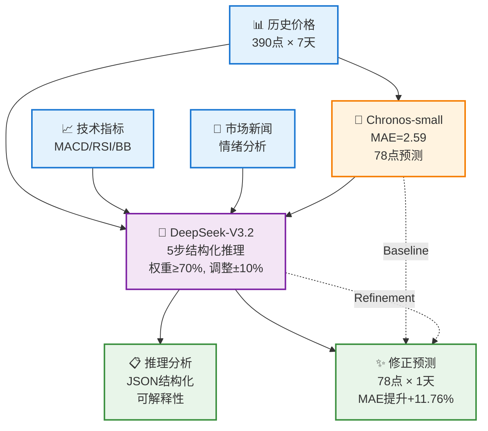

# 多模态股票预测系统 - 核心架构一页图

## 系统核心流程（简化版）



---

## 关键指标对比

| 指标 | Chronos基线 | DeepSeek优化 | 改善 |
|------|-----------|-------------|------|
| **MAE** | 3.5268 | **3.1121** | **+11.76%** ✓ |
| **RMSE** | 3.7792 | **3.4035** | **+9.94%** ✓ |
| **处理时间** | 0.5秒/样本 | 31秒/样本 | - |
| **成本** | 免费 | $0.0007/样本 | - |

---

## 核心创新

### 1️⃣ 约束优化策略
```
Chronos权重 ≥ 70%     →  充分信任SOTA模型
调整幅度 ≤ ±10%       →  避免过度修正
```

### 2️⃣ 结构化推理链
```
价格分析 → Chronos评估 → 技术面 → 基本面 → 综合决策
(每步都有reasoning，完全可解释)
```

### 3️⃣ 多模态融合
```
时序特征(Chronos) + 技术指标 + 新闻情绪 = 全面预测
```

---

## 优化前后对比

```
v1.0 (无约束)              v2.0 (约束优化)
─────────────────          ─────────────────
Chronos权重: 30-40%    →   Chronos权重: ≥70%
调整幅度: 无限制        →   调整幅度: ±10%
MAE: -14.72% ❌        →   MAE: +11.76% ✓
总改善: +26.48个百分点
```

---

## 技术栈（一句话版）

**数据**: Pandas/Parquet | **基线**: Chronos-small | **LLM**: DeepSeek-V3.2 | **API**: SiliconFlow | **评估**: scikit-learn

---

## 5步推理流程

```
┌─────────────┐
│ 1️⃣ 价格分析  │  识别趋势、波动性、关键模式
└─────┬───────┘
      ↓
┌─────────────┐
│ 2️⃣ Chronos评估│  判断AI预测是否合理
└─────┬───────┘
      ↓
┌─────────────┐
│ 3️⃣ 技术面评估 │  MACD/RSI是否与Chronos冲突
└─────┬───────┘
      ↓
┌─────────────┐
│ 4️⃣ 基本面评估 │  新闻情绪、盈利报告影响
└─────┬───────┘
      ↓
┌─────────────┐
│ 5️⃣ 综合决策  │  权重分配、调整策略、风险评估
└─────┬───────┘
      ↓
    ✨ 最终预测
```

---

## 使用场景

| 场景 | 适用性 | 优势 |
|------|-------|-----|
| **短期预测** | ✅ 极佳 | 1天窗口，高频交易 |
| **长期预测** | ⚠️ 待验证 | 需调整窗口大小 |
| **波动市场** | ✅ 良好 | LLM能识别异常模式 |
| **平稳市场** | ✅ 优秀 | Chronos已足够准确 |
| **新闻驱动** | ✅ 极佳 | 整合情绪分析 |

---

## 项目文件结构

```
MTBench/
├── 📊 数据文件
│   └── predictions_with_chronos.parquet (750样本)
├── 🐍 核心代码
│   ├── prompt_template.py (提示词生成)
│   ├── run_deepseek_correction.py (主流程)
│   └── test_chronos.py (基线测试)
├── 📈 结果文件
│   ├── deepseek_corrected_predictions.parquet
│   └── deepseek_evaluation_results.json
└── 📄 文档
    ├── SYSTEM_ARCHITECTURE.md (完整架构)
    ├── DEEPSEEK_OPTIMIZED_TEST_REPORT.md (优化报告)
    └── SYSTEM_ARCHITECTURE_ONEPAGE.md (本文档)
```

---

## 快速开始（3步）

```bash
# 1. 设置API密钥
export SILICONFLOW_API_KEY='your-key'

# 2. 运行测试（3样本调试）
python run_deepseek_correction.py

# 3. 查看结果
cat deepseek_evaluation_results.json
```

---

## 核心成果

✅ **准确性**: MAE提升 +11.76%
✅ **可解释性**: 100% JSON结构化推理
✅ **成本效益**: $0.0007/样本
✅ **工程化**: 模块化、容错、可扩展

---

**当前状态**: 🚀 750样本测试运行中 (84/750完成)
**预计完成**: 明天上午
**下一步**: 统计显著性验证 + Few-Shot优化

---

*本文档提供系统的精简概览，完整技术细节请参考 `SYSTEM_ARCHITECTURE.md`*
